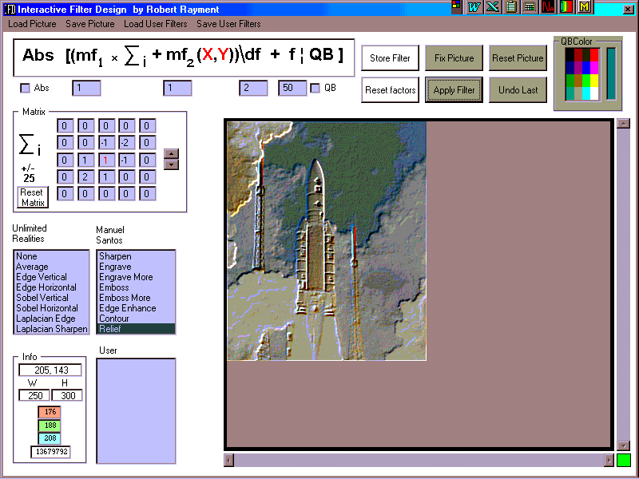



## Interactive Filter Design

### Description

Interactive Filter Design by Robert Rayment. IMPROVED: Input, VB or ASM, some user filters by Malcom Ferris(NZ) included in a *.ufi file.  I was in two minds about submitting this since it is really for my own use. Included are some 3x3 filters from Unlimited Realities and Manuel Santos. With this prog filters can be up to 5x5. What would interest me is whether anyone can find designs that are significantly different from the 3x3 filters with the filter formula I've used. Win98, Zip file 72KB.
 
### More Info
 
Just run

             |
---                |---
**Submitted On**   |2001-12-20 06:45:02
**By**             |[Robert Rayment](https://github.com/Planet-Source-Code/PSCIndex/blob/master/ByAuthor/robert-rayment.md)
**Level**          |Intermediate
**User Rating**    |5.0 (30 globes from 6 users)
**Compatibility**  |VB 6\.0
**Category**       |[Graphics](https://github.com/Planet-Source-Code/PSCIndex/blob/master/ByCategory/graphics__1-46.md)
**World**          |[Visual Basic](https://github.com/Planet-Source-Code/PSCIndex/blob/master/ByWorld/visual-basic.md)
**Archive File**   |[Interactiv4314512202001\.zip](https://github.com/Planet-Source-Code/robert-rayment-interactive-filter-design__1-29866/archive/master.zip)

### API Declarations

A few

